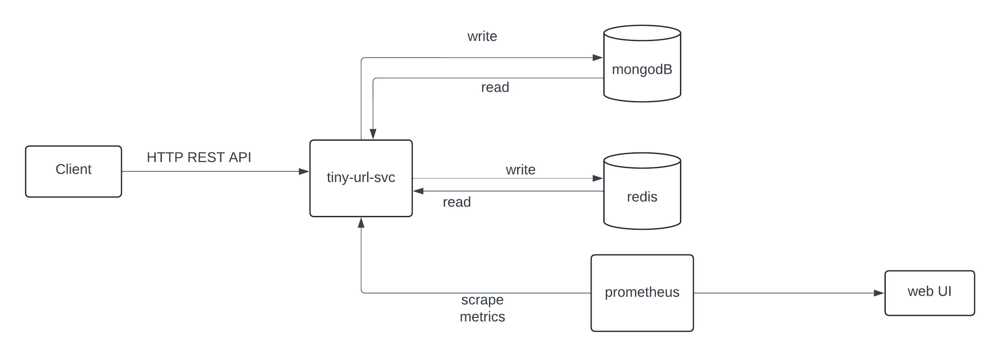
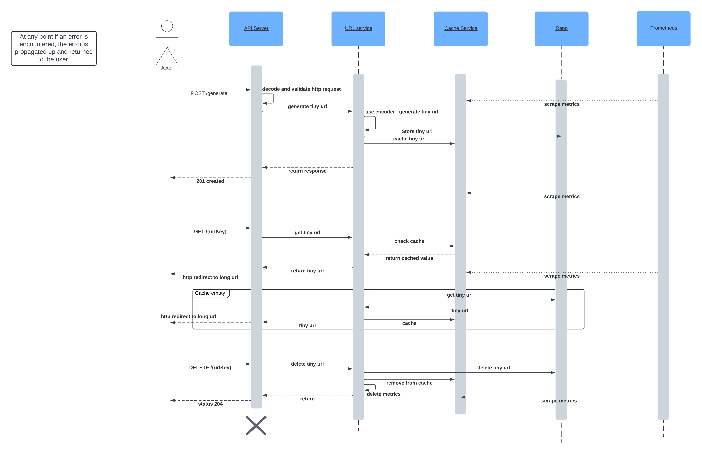

# Introduction
The service offers the following features:
- Generate a tiny URL
    - creates a tiny url for the input long url 
- get tiny url
  - redirects the user to the long url represented by the tiny url
- delete a tiny url

A Tiny URL Request is represented by the following
```
{
    "url": "",
    "liveForever": 
}
```
The input takes the long url for which a tiny url is generated. `liveForever` is optional, defaults to false.
Authentication and Authorization were not scoped for this project. Updating flows were also not considered. 
 

The API service listens on `:8000`. The server also exposes `/metrics` endpoint.

### Repo structure
- `cmd`: exposes the start functionality for the HTTP server.
- `docker`: docker-related files for docker compose.
- `pkg`: application code.
  - `apis`: rest handler implementation.
  - `cache`: redis cache service implementation.
  - `db`: db repo implementation.
  - `url`: url service implementation.
- `types`: declares types, interfaces, generated code, and errors used by the application
- `schema`: OAS3 API definition 

### Data Model
For the persistence layer we use mongodb. We store an object in mongodb.
```
{
  "base_10_id": {
    "$numberLong": "1041336175"
  },
  "url_key": "2b27xz",
  "long_url": "https://stackoverflow.com/questions/8078018/get-redis-keys-and-values-at-command-prompt",
  "expire_time": {
    "$date": "2024-04-01T08:17:08.080Z"
  },
  "live_forever": false
}
```

### Cache
Use redis to cache the generated url

### Design
This is a GO-based service that exposes REST APIs to perform different actions. The API is documented as OAS in the `schema/` directory. The API service and db run as containers orchestrated by docker compose.

```
HTTP server: Echo server
Persistence: MongoDB
Cache: Redis
Metrics: Prometheus
Orchestration: docker compose
```





Requests are handled by the rest handlers injected with middleware for validation of input. The API request is validated
and handed of to the service to generate the tiny url. The url is added to the data store and persisted. It is also added
to the cache for quick lookups. 

#### Design Decisions
1. The connection details for mongo db and redis cache were hardcoded for simplicity. This would have been done a configuration struct.
2. The same long url can generate multiple different tiny url. We do not return a conflict error if the same long url is used.
3. mongodb is used for the db because of the type of data we are storing and scalability.
4. redis cache for quick look-ups and can be horizontally scaled.
5. prometheus as a metrics aggregator which scrapes the metrics for application
6. For the tiny url, we generate a unique base10 integer which is then base58 encoded. base58 was chosen because it has better readability, less ambiguity compared to base64 and offers a better user experience.


All the schemas for requests, responses, paths, and query params are documented using an OpenAPI Specification YAML.

### Getting started

1. You will need to make sure you have docker installed on your machine. This can be installed using any package manager like apt or homebrew.
2. To run the unit test you will need go installed.
3. Clone or download the source code and `cd` into the directory.

Software Versions:
1. Go version: 1.22.1
2. Docker: 24.0.6

   a. This version of Docker should have `compose` with it. Older versions use `docker-compose`


To start the services
```
make up
```
If this command returns an error due to `compose` not being a docker command you can run
```
make up-legacy
```

To stop the services
```
make down
```
If this command returns an error due to `compose` not being a docker command you can run
```
make down-legacy
```

If vendor directory is out of sync. This shouldn't happen unless the go.mod is changed.
```
make tidy vendor 
```

### Testing

To run unit tests
```
make test
```
To run test and get the coverage information
```
make coverage
```

Note: You will only need `go` to run the tests as they use `go test`. Running the services do not require Go.

### Metrics
Prometheus scrapes the application for metrics regarding the application and API usage. The prometheus UI can be accessed
at `localhost:9090`

`tiny_url_svc_tiny_url_usage`: descirbe the metrics for the usage of the tiny url.

Example PQL:
```
tiny_url_svc_tiny_url_usage{url_key="25q99m"}
```
Queries prometheus for the metric using the label of the key generated for the tiny url. You can specify time ranges to 
see the value of the counter metric. 
Basic application metrics like measuring goroutines, cpu, memory etc. are also available. 
